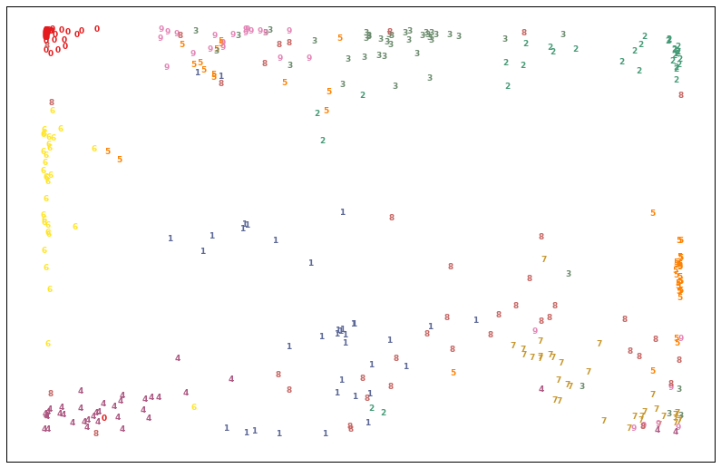

# Feather
A light-weight framework of neural networks built with `python` and `numpy`. Implements multilayer perceptrons and deep stacked autoencoders.

These deep autoencoders are built by sequentially training and stacking shallow autoencoders. For conceptual details, see:
https://www.cs.toronto.edu/~hinton/science.pdf

### Installation
You don't need to install in order to use it, but it makes the imports easier. Clone this repo and `cd` into the root `feather/` folder, then execute
```pip install .```


### Let's use the MNIST handwritten-digit dataset from `scikit-learn` to demonstrate the use of our multilayer perceptron and autoencoder.


```python
import numpy as np
%matplotlib inline
import matplotlib
import matplotlib.pyplot as plt
from sklearn.cross_validation import train_test_split
from sklearn.datasets import load_digits
from sklearn.preprocessing import OneHotEncoder, StandardScaler
#
from feather import ann, stacker
```

### Data preparation


```python
# Get the digits data dump
digits = load_digits()

# Extract X and y arrays
X = digits.data
y = digits.target

# Scale X
sc = StandardScaler()
sc.fit(X)
Xs = sc.transform(X)

# Onehot-encode the target labels
enc = OneHotEncoder()
enc.fit([[l] for l in set(y)])
onehot_labels = enc.transform(y.reshape(-1, 1)).toarray()

# Split into train and test samples
train_X, test_X, train_y, test_y =  \
train_test_split(Xs, onehot_labels, test_size=0.2)
```

### Classification example with MLP


```python
# Initialize network. The input dimension is 64
# (each image is an 8x8 array), and here we assign
# hidden depths of [20,15]. Thus, the full stack of
# layers depths is [64, 20, 15, 10], where the 10-dimensional
# output represents a probability distribution over the
# ten possible digit labels.
mlp = ann.ANN(
    train_X,
    train_y=train_y,
    hidden_depths=[20,15],
    test_X=test_X,
    test_y=test_y,
    eta=0.03,
    lamb=5.0,
    batch_size=30,
    initzero=False,
    activation_type='tanh',
    softmax=True,
    cost_type='Xentropy')

# Fit over some epochs
mlp.fit(40)
# If you notice that the train accuracy is much better
# than the test, then you could adjust for overfitting by
# increasing the lambda parameter and fit over more epochs.
# You can also decrease the learning parameter to fine-tune
# fitting:
# mlp.lamb = 10.
# mlp.eta = 0.01
# mlp.fit(30)
```
    Epoch 0 train_accuracy: 0.160  test_accuracy: 0.247
    Epoch 1 train_accuracy: 0.355  test_accuracy: 0.403
    Epoch 2 train_accuracy: 0.489  test_accuracy: 0.456
    ...
    Epoch 38 train_accuracy: 0.981  test_accuracy: 0.933
    Epoch 39 train_accuracy: 0.983  test_accuracy: 0.933


```python
# Get predictions for any test set. These are
# probabilities for the labels [0,1,2,3,4,5,6,7,8,9]
softmax_preds = mlp.predict_proba(test_X)
print softmax_preds[0]
```

    [  1.58477258e-02   1.10900283e-02   1.01264357e-02   8.43358279e-04
       9.99592807e-03   4.15000425e-03   9.22892138e-01   7.57619799e-03
       1.47537990e-02   2.72438434e-03]


### Autoencoder example


```python
# Intialize autoencoder, where the deepest enconding
# dimension is 2. Since the input dimension is 64,
# the full stack of layer depths becomes [64, 20, 9, 2, 9, 20, 64].
# Essentially, we are trying to reconstruct the 64-dimensional
# input data by passing it through a "narrow" encoding funnel
# of dimension 2.
ae = stacker.Autoencoder(Xs,
    hidden_depths=[20,9,2],
    epochs=50,
    eta=0.03,
    lamb=5,
    batch_size=30,
    activation_type='tanh')

# Train autoencoder
ae.run_stacker()
# Fine-train autoencoder, now that it has been stacked together
ae.stacked_net.fit(30)
```
    Starting run 0
    Epoch 0 train_accuracy: 0.162
    Epoch 1 train_accuracy: 0.314
    Epoch 2 train_accuracy: 0.351
    ...
    Epoch 28 train_accuracy: 0.292
    Epoch 29 train_accuracy: 0.291

```python
# Get encoded representation of the test set
test_X_encoded = stacker.encode(test_X, ae.stacked_net)
```

#### Visualizing the embedding

```python
# Get the labels for the test set, these are the digit numbers
test_labels = np.argmax(test_y, axis=1)

# Plot
plt.figure(figsize=(14,9))
for i in range(test_X_encoded.shape[0]):
    plt.text(test_X_encoded[i, 0], test_X_encoded[i, 1], str(test_labels[i]),
             color=plt.cm.Set1(test_labels[i] / 10.),
             fontdict={'weight': 'bold', 'size': 9})
plt.xticks([])
plt.yticks([])
plt.xlim([-1.1, 1.1])
plt.ylim([-1.1, 1.1])
plt.show()
```





For more info on other methods for dimensionlality reduction, see:
http://scikit-learn.org/stable/auto_examples/manifold/plot_lle_digits.html

Note that for simple problems like this example, where we map 64 dimensions to 2, methods like t-SNE provide probably the best performance. Deep autoencoders are better suited for higher input and output dimensions.
